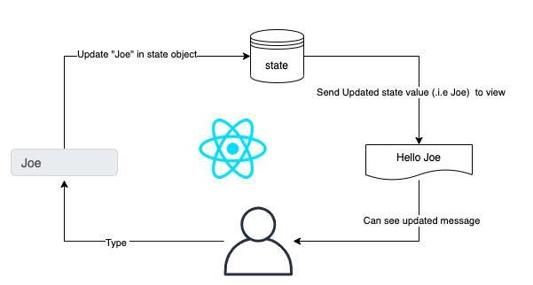

# what is state in React js

  1. state is in object formate in react js   
  2. state is mutable can  be changed or update one components data to another 
  4. state are used to read data | edit data | modify data | update data 
  5. state are passed and used data one components to another components to parent to child and update also
  6. state data are access via hooks using useState hooks in react js 

     import React,{useState} from 'react'
     const[data,setData]=useState(0)

    ```
     function App()
     {
        return (
            <>
               <h1>The data values is : {data}</h1>
            </>
        )
     }
     export default App
    ```


# architectures of react js state 




# what is destructuring in  state   ?
  
  ```
   import React,{useState} from 'react'
   const[data,setData]=useState(0)

   where data is variable
   setData is function 
   useState() stored any data types of values 

  ```

  **examples of state**

  ```
  import React,{useState} from "react";
function NameApp()
{
//destructuring odf state 
const[name,setName]=useState("Brijesh kumar pandey");
 return(
    <>
        <div className="app">
           <h1>My name is : {name}</h1> 
           <button type="button" onClick={()=>setName("Aksh Patel")}>Change Name ?</button>
        </div>
    </>
 )   
}

export default NameApp 

  ```


  ```
   import React,{useState} from "react";
function NameMultipleApp()
{
//destructuring odf state 
const[name,setName]=useState({
    id:1,
    name:"Brijesh kumar pandey",
    age:35,
    salary:89500,
    address:"150 feet ring road rajkot"
});

// create a function for multiple data update via state 
const updData=()=>{
    setName({
    id:1,
    name:"Aksh patel",
    age:21,
    salary:9500,
    address:"behind navrangpura Ahemdabad 360005"
    })
}

 return(
    <>
        <div className="app">
           
           <h1>Employee Id is  : {name.id}</h1> 
           <h2>Employee Name is  : {name.name}</h2> 
           <h3>Employee Age is  : {name.age}</h3> 
           <h4>Employee salary is  : {name.salary}</h4> 
           <h5>Employee Address is  : {name.address}</h5> 
           <button type="button" onClick={updData}>Change All ?</button>
        </div>
    </>
 )   
}

export default NameMultipleApp

  ```


  ```
   import React,{ useState} from "react";
function CounterApp()
{
// destructured state 
const[count,setCount]=useState(0);
 return(
    <>
        <div className="counter-app">
            <h1>The count default values is : {count}</h1>
            <button type="button" onClick={()=>setCount(count+1)}>+</button>
            <button type="button" onClick={()=>setCount(count-1)}>-</button>
            <button type="button" onClick={()=>setCount(0)}>Reset</button>
        </div>
    </>
 )
}
export default CounterApp

  ```